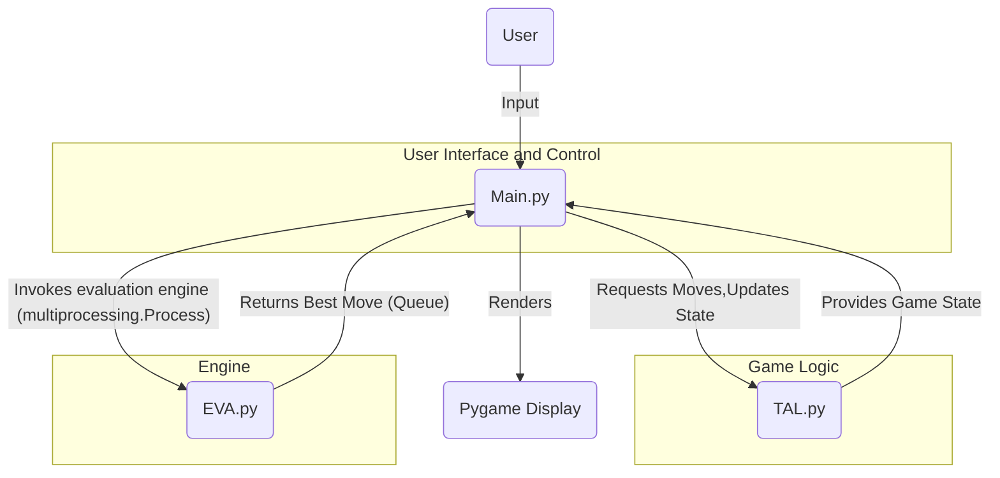
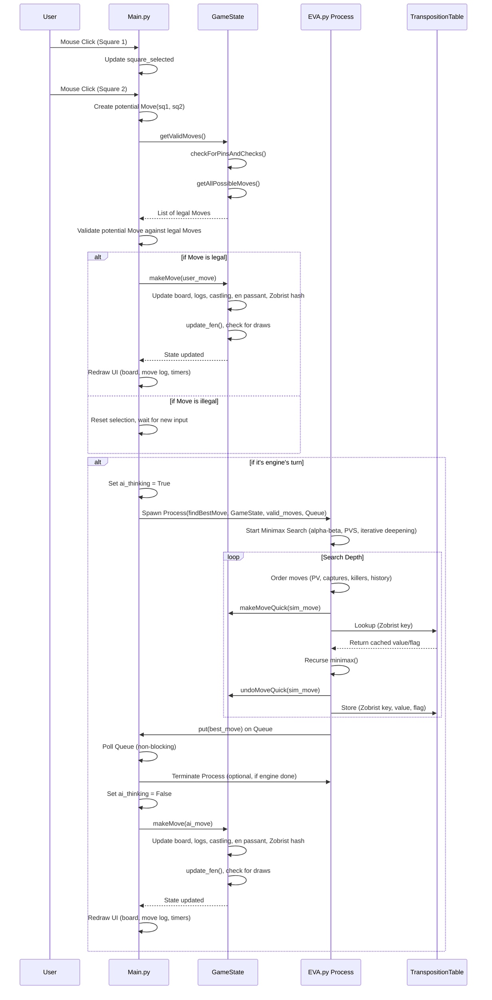

# TAL_chess_engine : Documentation

---

## Table of Contents
- [Project set-up](#project-set-up)  
  - [1. Installation](#1-installation)  
    - [Clone the repository](#clone-the-repository)  
    - [Optional) Create and activate a virtual environment](#optional-create-and-activate-a-virtual-environment)  
    - [Install dependencies](#install-dependencies)  
  - [2. How to Run](#2-how-to-run)  

- [Documentation](#documentation)  
  - [1. Introduction](#1-introduction)  
    - [1.1. Purpose of this Document](#11-purpose-of-this-document)  
    - [1.2. Scope of the Chess Engine](#12-scope-of-the-chess-engine)  
    - [1.3. Target Audience](#13-target-audience)  
  - [2. System Overview and Architectural Design](#2-system-overview-and-architectural-design)  
    - [2.1. High-Level System Components](#21-high-level-system-components)  
    - [2.2. Architectural Style: Layered / MVC Principles](#22-architectural-style-layered-mvc-principles)  
    - [2.3. Component Interaction Diagram](#23-component-interaction-diagram)  
    - [2.4. Data Flow Overview](#24-data-flow-overview)  
  - [3. Module Decomposition and Responsibilities](#3-module-decomposition-and-responsibilities)  
    - [3.1. TAL.py: Game State and Rules Engine](#31-talpy-game-state-and-rules-engine)  
    - [3.1.1. Board Representation and Coordinate System](#311-board-representation-and-coordinate-system)  
    - [3.1.2. GameState Class: Core State Management](#312-gamestate-class-core-state-management)  
    - [3.1.3. Move Class: Move Representation and Notation](#313-move-class-move-representation-and-notation)  
    - [3.1.4. CastleRights Class: Castling State Tracking](#314-castlerights-class-castling-state-tracking)  
    - [3.1.5. FEN Integration (fen_utils functionality)](#315-fen-integration-fen-utils-functionality)  
    - [3.2. EVA.py: Evaluation Engine](#32-evapy-evaluation-engine)  
    - [3.2.1. Search Algorithm: Minimax with Alpha-Beta Pruning](#321-search-algorithm-minimax-with-alpha-beta-pruning)  
    - [3.2.2. Search Enhancements](#322-search-enhancements)  
    - [3.2.3. Evaluation Function (evaluateBoard)](#323-evaluation-function-evaluateboard)  
    - [3.2.4. Asynchronous Operation](#324-asynchronous-operation)  
    - [3.3. Main.py: User Interface (UI) and Game Control](#33-mainpy-user-interface-ui-and-game-control)  
    - [3.3.1. Pygame Initialization and Display Management](#331-pygame-initialization-and-display-management)  
    - [3.3.2. Event Handling and Input Processing](#332-event-handling-and-input-processing)  
    - [3.3.3. Game Loop and State Updates](#333-game-loop-and-state-updates)  
    - [3.3.4. Graphical Rendering of Board and UI Elements](#334-graphical-rendering-of-board-and-ui-elements)  
    - [3.3.5. Evaluation Integration and Concurrency Management](#335-evaluation-integration-and-concurrency-management)  
    - [3.3.6. Game Timers and End-Game Display](#336-game-timers-and-end-game-display)  
  - [4. Core Data Structures and Their Design](#4-core-data-structures-and-their-design)  
    - [4.1. GameState Internal Structure and State Logging](#41-gamestate-internal-structure-and-state-logging)  
    - [4.2. Move Object Detailed Design](#42-move-object-detailed-design)  
    - [4.4. Heuristic Tables (_killers_, _history_)](#44-heuristic-tables-killers-history)  
  - [5. Move Generation and Validation Mechanics](#5-move-generation-and-validation-mechanics)  
    - [5.1. Pseudo-Legal Move Generation for Each Piece Type](#51-pseudo-legal-move-generation-for-each-piece-type)  
    - [5.2. Pin and Check Detection Algorithm (checkForPinsAndChecks)](#52-pin-and-check-detection-algorithm-checkforpinsandchecks)  
    - [5.3. Filtering Illegal Moves and King Safety](#53-filtering-illegal-moves-and-king-safety)  
    - [5.4. Special Move Implementation: Castling, En Passant, Pawn Promotion](#54-special-move-implementation-castling-en-passant-pawn-promotion)  
    - [5.5. Draw Condition Detection: Fifty-Move Rule, Threefold Repetition, Insufficient Material](#55-draw-condition-detection-fifty-move-rule-threefold-repetition-insufficient-material)  
  - [6. Evaluation Algorithms in Depth](#6-evaluation-algorithms-in-depth)  
    - [6.1. Minimax Search Principle and Implementation](#61-minimax-search-principle-and-implementation)  
    - [6.2. Alpha-Beta Pruning: Theoretical Basis and Practical Application](#62-alpha-beta-pruning-theoretical-basis-and-practical-application)  
    - [6.3. Principal Variation Search (PVS)](#63-principal-variation-search-pvs)  
    - [6.4. Iterative Deepening Framework](#64-iterative-deepening-framework)  
    - [6.5. Transposition Tables: Zobrist Hashing, Entry Structure, Flag Management](#65-transposition-tables-zobrist-hashing-entry-structure-flag-management)  
    - [6.6. Move Ordering Heuristics: Static Exchange Evaluation (SEE), Killer Moves, History Heuristic](#66-move-ordering-heuristics-static-exchange-evaluation-see-killer-moves-history-heuristic)  
    - [6.7. Null-Move Pruning: Concept, R-value, and Limitations](#67-null-move-pruning-concept-r-value-and-limitations)  
  - [7. Evaluation Function Design and Piece-Square Tables](#7-evaluation-function-design-and-piece-square-tables)  
    - [7.1. Material Balance Calculation](#71-material-balance-calculation)  
    - [7.2. Piece-Square Tables: Design, White/Black Symmetries, and Impact](#72-piece-square-tables-design-whiteblack-symmetries-and-impact)  
    - [7.3. King Safety and Endgame Considerations](#73-king-safety-and-endgame-considerations)  
    - [7.4. Game Phase Detection and Blending Evaluation](#74-game-phase-detection-and-blending-evaluation)  
    - [7.5. Static vs. Dynamic Evaluation](#75-static-vs-dynamic-evaluation)  
  - [8. User Interface Design and Event Handling](#8-user-interface-design-and-event-handling)  
    - [8.1. Pygame Framework Integration](#81-pygame-framework-integration)  
    - [8.2. Board Rendering and Piece Drawing Pipeline](#82-board-rendering-and-piece-drawing-pipeline)  
    - [8.3. Square Highlighting and Visual Feedback](#83-square-highlighting-and-visual-feedback)  
    - [8.4. User Input Processing: Mouse Clicks and Keyboard Events](#84-user-input-processing-mouse-clicks-and-keyboard-events)  
    - [8.5. FEN Input Modality and Clipboard Integration](#85-fen-input-modality-and-clipboard-integration)  
    - [8.6. UI Element Layout: Sidebars, Timers, Move Log](#86-ui-element-layout-sidebars-timers-move-log)  
  - [9. Concurrency Model and Performance Optimization](#9-concurrency-model-and-performance-optimization)  
    - [9.1. The Need for Concurrency in Chess Engines](#91-the-need-for-concurrency-in-chess-engines)  
    - [9.2. multiprocessing Module for Engine Search](#92-multiprocessing-module-for-engine-search)  
    - [9.3. Inter-Process Communication (IPC) with Queue](#93-inter-process-communication-ipc-with-queue)  
    - [9.4. Performance Bottlenecks and Mitigation Strategies](#94-performance-bottlenecks-and-mitigation-strategies)  
    - [9.5. Python-Specific Optimizations and Considerations](#95-python-specific-optimizations-and-considerations)  
  - [10. Software Engineering Best Practices](#10-software-engineering-best-practices)  
    - [10.1. Modularity and Code Organization](#101-modularity-and-code-organization)  
    - [10.2. Readability and Documentation (Docstrings, Comments)](#102-readability-and-documentation-docstrings-comments)  
    - [10.3. Error Handling and Robustness](#103-error-handling-and-robustness)  
    - [10.4. Code Style and Linting](#104-code-style-and-linting)  
  - [11. Testing Methodologies and Quality Assurance](#11-testing-methodologies-and-quality-assurance)  
    - [11.1. Unit Testing Strategy](#111-unit-testing-strategy)  
    - [11.2. Integration Testing and Game Playthroughs](#112-integration-testing-and-game-playthroughs)  
    - [11.3. Regression Testing for Rule Compliance](#113-regression-testing-for-rule-compliance)  
    - [11.4. Performance Benchmarking](#114-performance-benchmarking)  
  - [12. Extensibility, Future Enhancements, and Integration](#12-extensibility-future-enhancements-and-integration)  
    - [12.1. Extending the Evaluation Engine: Opening Books, Endgame Tablebases, NNUE](#121-extending-the-evaluation-engine-opening-books-endgame-tablebases-nnue)  
    - [12.2. Expanding Game Rules: Chess960, Custom Variants](#122-expanding-game-rules-chess960-custom-variants)  
    - [12.3. UI Enhancements: Drag-and-Drop, Animations, Themes](#123-ui-enhancements-drag-and-drop-animations-themes)  
    - [12.4. Integration with External Systems (e.g., UCI Protocol)](#124-integration-with-external-systems-eg-uci-protocol)  
  - [13. Known Limitations](#13-known-limitations)  
  - [14. Appendices](#14-appendices)  
    - [14.1. Conceptual UML Class Diagram](#141-conceptual-uml-class-diagram)  
    - [14.2. Conceptual UML Sequence Diagram (User Move to Engine Response)](#142-conceptual-uml-sequence-diagram-user-move-to-engine-response)  


# Set-up Guide

## 1. Installation

### **Clone the repository**

```bash
git clone <https://github.com/your-username/tal-chess-engine.git>
cd tal-chess-engine
```

### **(Optional) Create and activate a virtual environment**

```bash
python3 -m venv venv
source venv/bin/activate    # macOS/Linux
venv\Scripts\activate       # Windows
```

### **Install dependencies**

```bash
pip install -r requirements.txt
```

*If you don’t have a `requirements.txt`, install manually:*

```bash
pip install pygame pyperclip
```

---

## 2. How to Run

From the project root directory, execute:

```bash
python Main.py
```

If you have multiple Python versions:

```bash
python3 Main.py
```

# Documentation

## 1. Introduction

### 1.1. Purpose of this Document

The primary purpose of this documentation is to serve as a single
source of truth for the TAL Chess Engine’s design and implementation. It
aims to:

- Detail the high-level system architecture and how different modules interact.
- Provide in-depth descriptions of the algorithms used for game logic, engine search, and evaluation.
- Explain the design and purpose of key data structures.
- Outline the concurrency model employed for responsive user interaction.
- Discuss performance considerations and optimization strategies.
- Offer guidance on testing methodologies and future extensibility.
- Act as a reference for the project

### 1.2. Scope of the Chess Engine

The current version of the TAL Chess Engine provides:

- A complete implementation of standard chess rules, including special moves like castling, en passant, and pawn promotion.
- Detection of game-ending conditions: checkmate, stalemate, threefold repetition, fifty-move rule, and insufficient material.
- An engine bot opponent utilizing a minimax search algorithm with alpha-beta
pruning and several advanced heuristics (transposition tables, killer
moves, history heuristic, null-move pruning).
- A graphical user interface built with Pygame, supporting user input
via mouse and keyboard, displaying the board, pieces, move history,
timers, and game status.
- Asynchronous move calculation to ensure a fluid user experience.

### 1.3. Target Audience

This document is primarily intended for:

- **Software Developers:** Engineers responsible for maintaining, debugging, or extending the codebase.
- **Researchers:** Individuals interested in understanding the specific algorithms and heuristics implemented.
- **Project Managers:** Stakeholders needing a technical overview of the system’s capabilities and architecture.
- **Students:** Learners seeking a practical example of chess engine development and applications.

---

## 2. System Overview and Architectural Design

The TAL Chess Engine is designed with modularity and separation of
concerns as guiding principles. This approach enhances maintainability,
testability, and scalability.

### 2.1. High-Level System Components

The engine is logically divided into three primary components, each encapsulated within its own Python module:

- **`TAL.py` (The Game State and Rules Engine):** This module serves as the core logic unit of the chess engine. It is
responsible for representing the current state of the chessboard,
enforcing all standard chess rules (including complex ones like
castling, en passant, and pawn promotion), generating all legal moves
for a given position, and tracking game metadata such as move history,
castling rights, and conditions for draws. It is designed to be purely
functional in terms of chess logic, independent of any user interface or engine decision-making. The `fen_utils` functionality, for converting FEN strings to board representations and
vice-versa, is conceptually integrated within this module’s
responsibilities, particularly within the `GameState` class’s initialization and `update_fen` method.
- **`EVA.py` (The Evaluation Engine):** This module embodies the “brain” of the chess engine. Its primary role
is to determine the optimal move for the engine given a specific game state. It achieves this through a sophisticated combination of search
algorithms (minimax with alpha-beta pruning) and various
performance-enhancing heuristics (transposition tables, killer moves,
history heuristic, null-move pruning). Furthermore, it includes a robust evaluation function that assigns a numerical score to any given board
position, considering factors like material balance, piece activity,
king safety, and game phase. This module operates solely on game state
data, without direct interaction with the user interface.
- **`Main.py` (The User Interface and Game Controller):** This module acts as the orchestrator and the user-facing component of
the chess engine. Built upon the Pygame library, it manages the
graphical rendering of the chessboard, pieces, and all associated UI
elements (move log, timers, status messages). Crucially, it handles all
user interactions, translating mouse clicks and keyboard inputs into
game actions. It also coordinates the flow of the game, deciding when
it’s the human player’s turn or the engine’s turn, and managing the
asynchronous invocation of the engine evaluation to ensure a smooth and
responsive user experience.

### 2.2. Architectural Style: Layered / MVC Principles

The TAL Chess Engine’s architecture can be best described as a
layered system, adhering strongly to the principles of
Model-View-Controller (MVC) separation:

- **Model (TAL.py):** This layer represents the application’s core logic and data. It contains the `GameState` and `Move` classes, which encapsulate the state of the chessboard and the rules
governing moves. Any change in the game state or rule enforcement
happens within this layer. It is entirely decoupled from how the data is presented or how user input is received.
- **View (Part of Main.py):** This layer is responsible
for rendering the game state to the user. It takes the current board
configuration and other game information from the Model layer and
translates it into visual elements on the screen, such as the
chessboard, pieces, move highlights, and side panels. It does not
contain any game logic or decision-making capabilities.
- **Controller (Part of Main.py):** This layer acts as the intermediary between the Model and the View, and the user. It receives
user inputs (mouse clicks, key presses), interprets them, and translates them into commands for the Model (e.g., `makeMove`, `undoMove`). It also decides when to invoke the evaluation engine (EVA.py) and updates the View
based on changes in the Model. The Controller manages the overall game
flow, including turn management and game-ending conditions.
- **Engine (EVA.py):** While not a traditional MVC layer, the
engine module acts as a specialized service consumed by the Controller. It
operates on data provided by the Model (via the Controller) and returns a decision (the best move) back to the Controller, which then applies it
to the Model. This separation ensures that the engine logic can be developed and optimized independently without affecting the core game rules or
the UI.

### 2.3. Component Interaction Diagram

This diagram illustrates the primary components and their communication pathways.

**Conceptual UML Component Diagram:**



**Description:**

- **User:** Interacts directly with `Main.py` through mouse clicks and keyboard inputs.
- **`Main.py`:** The central hub. It receives user input, renders the game state to the `Pygame Display`, and orchestrates the game flow.- **`Main.py` <–> `TAL.py`:** `Main.py` queries `TAL.py` for valid moves, sends user-selected moves to `TAL.py` for execution (`makeMove`), and requests game state information (e.g., `inCheck`, `checkmate`). `TAL.py` provides the updated board and game status back to `Main.py`.
- **`Main.py` –> `EVA.py`:** When it’s the engine’s turn, `Main.py` initiates a new process to run `EVA.findBestMove`, passing the current `GameState` and valid moves. This is a one-way invocation for the computation.
- **`EVA.py` –> `Main.py`:** Once `EVA.py` completes its search, it places the determined best move onto a `multiprocessing.Queue`, which `Main.py` then retrieves to apply the engine’s move to the `GameState`.

### 2.4. Data Flow Overview

The flow of data within the TAL Chess Engine is meticulously managed to ensure consistency and responsiveness:

1. **Initialization:** At application startup, `Main.py` initializes Pygame, loads piece images, and creates an initial `GameState` object (from `TAL.py`).
2. **User Turn:**
    - `Main.py` continuously draws the current `GameState` on the screen.
    - It monitors `pygame.event.get()` for user input.
    - If a mouse click occurs, `Main.py` determines the clicked square. If it’s a valid first click (selecting a piece of the current player), it highlights the square and possible
    moves.
    - A second click attempts to form a `Move` object. `Main.py` checks if this `Move` is present in the list of `valid_moves` obtained from `TAL.GameState.getValidMoves()`.
    - If the move is legal, `Main.py` calls `TAL.GameState.makeMove()` to update the game state. This also internally triggers an update to
    the Zobrist hash, fifty-move counter, and repetition tracking.
    - `Main.py` then updates its internal flags (`move_made = True`), clears selections, and prepares for the next turn.
    1. **Engine Turn:**
    - If `move_made` is true and it’s the engine’s turn (determined by `game_state.white_to_move` and `player_one`/`player_two` flags in `Main.py`), `Main.py` initiates a search.
    - A `multiprocessing.Process` is spawned, targeting `EVA.findBestMove`, passing the current `GameState` and `valid_moves` via a `Queue`.
    - While the engine is thinking, `Main.py` continues to render the UI and manage timers, periodically checking the `Queue` for the engine’s result.
    - Once the engine returns a move, `Main.py` retrieves it from the `Queue`, calls `TAL.GameState.makeMove()` to apply it, and updates `move_made = True`.
3. **Game State Updates and Redraw:**
    - After any `makeMove()` call (human or engine), `Main.py` re-calculates `valid_moves` using `TAL.GameState.getValidMoves()`. This method performs checks for checkmate, stalemate, and draw conditions based on the new state.
    - The screen is then cleared and redrawn with the updated `GameState`, including new piece positions, highlights, move log entries, and timer values.
4. **Undo/Reset:**
    - If `K_z` (undo) or `K_r` (reset) is pressed, `Main.py` calls `TAL.GameState.undoMove()` (or creates a new `GameState` for reset), updates flags, and redraws the UI. If a process is running, it is terminated.

---

## 3. Module Decomposition and Responsibilities

This section provides a deeper dive into each core module, outlining
its specific responsibilities, key classes, and significant functions.

### 3.1. `TAL.py`: Game State and Rules Engine

The `TAL.py`
module is the backbone of the chess engine, embodying the complete set
of chess rules and managing the game’s state. It is designed for
correctness and efficiency, providing an abstract representation of the
game independent of how it is played or displayed.

### 3.1.1. Board Representation and Coordinate System

The chessboard is represented as an 8x8 Python list of lists (`self.board`). Each inner list represents a rank, and elements within it represent files.

- `self.board[row][col]` accesses a square.
- **Row Indexing:** `0` corresponds to rank 8 (black’s back rank), and `7` corresponds to rank 1 (white’s back rank). This is a common convention
in chess programming as it aligns with array indexing from top-left.
- **Column Indexing:** `0` corresponds to file ‘a’, and `7` corresponds to file ‘h’.
- **Piece Representation:** Single characters denote
pieces. Uppercase letters (‘P’, ‘R’, ‘N’, ‘B’, ‘Q’, ‘K’) represent White pieces, and lowercase letters (‘p’, ‘r’, ‘n’, ‘b’, ‘q’, ‘k’) represent
Black pieces. An empty square is denoted by `'-'`.

This consistent indexing allows for straightforward translation between internal coordinates and standard algebraic notation.

### 3.1.2. `GameState` Class: Core State Management

The `GameState`
class is the central data structure holding all information about the
current chess position. Its constructor can initialize a game from a
standard FEN string or the initial chess position.

**Key Attributes:**

- `board`: The 8x8 list representing the chessboard.
- `white_to_move`: A boolean indicating whose turn it is.
- `move_log`: A list of `Move` objects, recording every move made. This enables undo functionality.
- `white_king_location`, `black_king_location`: Tuples `(row, col)` storing the current coordinates of the kings. These are updated after every king move for fast check detection.
- `enpassant_possible`: A tuple `(row, col)` indicating the square where an en passant capture is possible. It is
updated after every pawn move and reset if no capture occurs.
- `enpassant_possible_log`: A history of `enpassant_possible` states, used for accurate undo.
- `current_castling_rights`: An instance of the `CastleRights` class, tracking the availability of castling for both sides.
- `castle_rights_log`: A history of `CastleRights` objects, enabling correct undo for castling rights.
- `fifty_move_counter`: An integer tracking the number of half-moves since the last pawn move or capture, used for the 50-move rule draw.
- `fifty_move_log`: A history of `fifty_move_counter` values for undo.
- `board_position_counts`: A dictionary mapping Zobrist hash keys (representing board positions
and side to move) to the number of times that position has occurred,
used for threefold repetition draw detection.
- `board_key_log`: A history of Zobrist hash keys for undo.
- `current_fen`: The FEN string representation of the current board state, updated after each move/undo.
- `checkmate`, `stalemate`: Boolean flags indicating terminal game states.
- `in_check`, `pins`, `checks`: Internal state variables used during move generation to quickly
determine if the king is in check, which pieces are pinned, and which
pieces are checking the king.

**Core Methods:**

- `__init__(self, fen=INITIAL_FEN)`: Initializes the game state. It parses the FEN string to set up the
board, king locations, side to move, castling rights, and en passant
square. It also initializes the move log, draw counters, and Zobrist
hash.
- `makeMove(self, move)`: Executes a given `Move` object on the board. This involves updating piece positions, switching
turns, updating king locations, handling special moves (pawn promotion,
en passant captures, castling rook movement), updating castling rights,
and crucially, updating the `fifty_move_counter` and `board_position_counts` for draw detection. It also calls `update_fen()` to keep the FEN string current.
- `undoMove(self)`: Reverts the last move made. This is a complex operation as it must
restore the board to its exact previous state, including piece
positions, captured pieces, turn, king locations, en passant status,
castling rights, fifty-move counter, and board repetition counts.
Careful handling of special moves (especially castling and en passant)
is critical here.
- `getValidMoves(self)`: The most complex method in `TAL.py`. It generates all *legal* moves from the current position. This involves:
    1. Calling `checkForPinsAndChecks()` to determine if the king is in check, and identify any pinned pieces.
    2. Generating all *pseudo-legal* moves (moves that follow piece movement rules but might leave the king in check) using `getAllPossibleMoves()`.
    3. Filtering these pseudo-legal moves based on whether they resolve or
    prevent a check, or if they are disallowed due to a piece being pinned.
    4. Adding special moves like castling (only if not in check and path is safe).
    5. Checking for checkmate, stalemate, and draw conditions (fifty-move,
    threefold repetition, insufficient material) after filtering.
- `getAllPossibleMoves(self)`: Iterates through the board and calls piece-specific move generation functions (e.g., `getPawnMoves`, `getRookMoves`) to generate all pseudo-legal moves.
- `checkForPinsAndChecks(self)`: A critical method that determines if the current player’s king is in
check and identifies any pieces that are pinned to the king. It does
this by “ray-casting” from the king’s position in all 8 directions (for
sliding pieces) and checking knight moves.
- `inCheck(self)`: A helper method that simply calls `squareUnderAttack` for the current player’s king’s location.
- `squareUnderAttack(self, row, col)`: Determines if a given square `(row, col)` is under attack by an opponent’s piece. This is achieved by temporarily switching the turn and generating all opponent’s possible moves, then
checking if any of them target the specified square.
- `updateCastleRights(self, move)`: Updates the `current_castling_rights` based on the given move. Rights are lost if a king moves, a rook moves
from its original square, or a rook is captured on its original square.
- `updateFiftyMoveCounter(self, move)`: Increments the counter or resets it if a pawn moves or a capture occurs.
- `updateRepetition(self)`: Updates the `board_position_counts` dictionary with the current Zobrist hash.
- `checkThreefoldRepetition(self)`: Checks if any position has occurred three or more times.
- `insufficientMaterial(self)`: Determines if the remaining material on the board is insufficient to
force a checkmate (e.g., King vs. King, King + Knight vs. King).
- `getBoardKey(self)`: Generates a unique string key for the current board state and turn, used for repetition tracking.
- `update_fen(self)`: Reconstructs the full FEN string from the current `GameState` attributes. This method encapsulates the functionality of `fen_utils.board_to_fen` and other FEN-related logic.

### 3.1.3. `Move` Class: Move Representation and Notation

The `Move`
class is a lightweight data structure that encapsulates all the
necessary information about a single chess move. It’s crucial for the `move_log` and for communicating moves between modules.

**Key Attributes:**

- `start_row`, `start_col`: Coordinates of the piece that moved.
- `end_row`, `end_col`: Coordinates of the destination square.
- `piece_moved`: Character of the piece that moved.
- `piece_captured`: Character of the piece captured, or `'-'` if no capture. Special handling for en passant.
- `is_pawn_promotion`: Boolean flag.
- `promotion_choice`: Character (‘Q’, ‘R’, ‘B’, ‘N’) if promotion occurs.
- `is_enpassant_move`: Boolean flag for en passant captures.
- `is_castle_move`: Boolean flag for castling moves.
- `is_capture`: Boolean flag for any capture.
- `moveID`: A unique integer identifier for each move, computed from its coordinates. Used for efficient equality checks (`__eq__`).

**Key Methods:**

- `__init__(self, start_square, end_square, board, is_enpassant_move=False, is_castle_move=False)`: Constructor that initializes move properties. It correctly identifies pawn promotions and sets `piece_captured` for en passant moves.
- `__eq__(self, other)`: Overrides the equality operator to compare moves based on their `moveID`, ensuring that identical moves are recognized as such.
- `getChessNotation(self)`: Returns the move in standard algebraic notation (e.g., “e4”, “Nf3”,
“Qxf7+”, “O-O”, “0-0-0”). This method includes logic for disambiguation
(though limited to basic cases) and special move notations.
- `getRankFile(self, row, col)`: A helper method to convert `(row, col)` coordinates to algebraic notation (e.g., `(7, 4)` -> “e1”).

### 3.1.4. `CastleRights` Class: Castling State Tracking

A simple data class used to bundle the four castling rights flags.

**Attributes:**

- `wks`: White King-Side castling right (boolean).
- `bks`: Black King-Side castling right (boolean).
- `wqs`: White Queen-Side castling right (boolean).
- `bqs`: Black Queen-Side castling right (boolean).

### 3.1.5. FEN Integration (`fen_utils` functionality)

The `fen_utils.py` functionalities are crucial for `TAL.py`, specifically within the `GameState` class.

- **FEN to Board Conversion:** The `GameState.__init__` method incorporates logic to parse the board part of a FEN string (`rnbqkbnr/pppppppp/8/8/8/8/PPPPPPPP/RNBQKBNR`) into the internal 8x8 list representation. This involves iterating
through ranks, expanding numbers (e.g., ‘8’ becomes eight empty
squares), and mapping piece characters.
- **Board to FEN Conversion:** The `GameState.update_fen()` method constructs the FEN string from the current `GameState`. This involves converting the 8x8 board back into the FEN board string
(compressing empty squares), appending the active color, castling
availability, en passant target square, halfmove clock, and fullmove
number. This ensures that the engine’s internal state can always be
represented and potentially reloaded from a standard FEN string.

### 3.2. `EVA.py`: Evaluation Engine

The `EVA.py`
module is dedicated to the evaluation aspect of the chess
engine. It employs a sophisticated search algorithm combined with a
detailed evaluation function to determine the optimal move.

### 3.2.1. Search Algorithm: Minimax with Alpha-Beta Pruning

The core of the engine is the `minimax` function, which performs a recursive depth-first search of the game tree.

- **Minimax Principle:** The engine attempts to maximize its
own score while assuming the opponent will always play to minimize the
engine’s score (or maximize their own).
- **Alpha-Beta Pruning:** This optimization significantly reduces the number of nodes searched by eliminating branches that
cannot possibly influence the final decision. It maintains two values, `alpha` (the minimum score that the maximizing player is assured of) and `beta` (the maximum score that the minimizing player is assured of). If `alpha` becomes greater than or equal to `beta`, the current branch can be pruned.

### 3.2.2. Search Enhancements

To make the search computationally feasible and more effective, `EVA.py` incorporates several advanced techniques:

- **Transposition Tables (`_tt`):** A hash table that stores evaluations of previously encountered
positions. When the search encounters a position it has already analyzed (due to different move orders leading to the same state), it can
retrieve the stored value instead of re-calculating, drastically
reducing redundant computations. Entries include the evaluation score,
the search depth at which it was found, and a “flag” (`EXACT`, `LOWER`, `UPPER`) indicating the type of bound the score represents. Zobrist hashing (managed by `TAL.py`) provides the unique key for these tables.
- **Killer Moves (`_killers`):** A simple heuristic that prioritizes moves that caused an alpha-beta
cutoff (i.e., “killed” a branch) at the same depth in the search tree.
These moves are likely to be good and can lead to early cutoffs in other branches. `_killers` is a dictionary mapping depth to a list of (typically two) killer moves.
- **History Heuristic (`_history`):** A more general heuristic that keeps track of how often non-capture
moves cause cutoffs across the entire search. Moves that frequently lead to cutoffs are assigned higher “history” scores and are tried earlier
in the search. `_history` is a dictionary mapping `(depth, start_row, start_col, end_row, end_col)` to a score.
- **Null-Move Pruning:** An aggressive pruning technique
where the current player “passes” their turn (makes a “null move”) and
allows the opponent to move. If the opponent’s best response to this
null move is still very bad, it suggests the current position is strong, and the current player might not need to search their own moves deeply. This is a heuristic and can sometimes lead to errors (“null move
pathologies”) so it’s typically used with caution (e.g., only when not
in check and with sufficient material) and a reduced search depth (`d - 3` in the provided code).
- **Iterative Deepening:** The `findBestMove` function employs iterative deepening. Instead of directly searching to the full `depth`, it performs searches at `depth=1`, then `depth=2`, and so on, up to the target depth. The primary benefit is that the
results from shallower searches (especially the best move found, known
as the Principal Variation or PV) can be used to significantly improve
move ordering for deeper searches, leading to more alpha-beta cutoffs.
It also allows the engine to return a “best move so far” if interrupted.
- **Principal Variation Search (PVS):** Also known as
NegaScout, PVS is an optimization of alpha-beta. It assumes that the
first move searched is the best move (the “principal variation”) and
performs a full-width search for it. Subsequent moves are then searched
with a “null window” (`(alpha, alpha + 1)`), which is a very narrow window designed to quickly check if the move is
better than the current best. If it is, a re-search with a full window
is performed. This can be significantly faster when the move ordering is good.

### 3.2.3. Evaluation Function (`evaluateBoard`)

The `evaluateBoard` function assigns a numerical score to a given `GameState`, representing how favorable the position is for the white player. A positive score favors White, a negative score favors Black.

- **Material Score:** Calculated by summing the `piece_score` values for all pieces on the board. White pieces add to the score, Black pieces subtract.
    - `piece_score = {"P": 100, "N": 300, "B": 320, "R": 500, "Q": 900, "K": 0}`. King material value is zero as its capture ends the game.
- **Positional Score (Piece-Square Tables):** Each piece type has a corresponding 8x8 table (e.g., `pawn_table`, `knight_table`) that assigns a bonus or penalty to a piece based on its square. This
encourages pieces to occupy strategically important squares (e.g., pawns in the center, knights on active squares). For black pieces, the table
is mirrored vertically (`7 - r`).
- **King Safety and Endgame:**
    - The `king_table` is used for the midgame.
    - The `king_endgame_table` is used for the endgame, emphasizing king centralization.
    - **Game Phase Blending:** The `stage` variable (0.0 for opening, 1.0 for endgame) is computed based on the number of non-king pieces remaining (`MAX_NON_KING_PIECES = 29`). The king’s positional score is a blend of midgame and endgame table values: `(1.0 - stage) * mid_val + stage * end_val`.
    - **Material-Difference-Based King Bonuses:** In the endgame, if there’s a significant material difference, the
    engine encourages the stronger side’s king to be more central (closer to the opponent’s king) and the weaker side’s king to be cornered. `CENTER_WEIGHT` and `PROX_WEIGHT` tune these effects.
- **Terminal States:** `CHECKMATE` (100000) and `STALEMATE` (0) are special values returned immediately if a game-ending condition is detected, overriding any positional evaluation.

### 3.2.4. Asynchronous Operation

The `EVA.findBestMove` function is designed to be called in a separate process. It takes a `return_queue`
as an argument and places the best move found onto this queue upon
completion. This design pattern is critical for maintaining UI
responsiveness in `Main.py`.

### 3.3. `Main.py`: User Interface (UI) and Game Control

`Main.py`
is the entry point of the application and handles all user-facing
interactions and the overall game flow. It acts as the Controller and
View.

### 3.3.1. Pygame Initialization and Display Management

- `pygame.init()` and `pygame.font.init()`: Initializes Pygame modules.
- Font Definitions: Global font objects (`FONT_LARGE`, `FONT_MEDIUM`, `FONT_SMALL`) are initialized for consistent text rendering.
- Window Setup: Sets the window icon and caption.
- Fullscreen Mode: The application starts in fullscreen mode (`p.FULLSCREEN`), and board/panel sizes are dynamically calculated based on screen resolution to ensure optimal layout.
- `p.scrap.init()`: Initializes Pygame’s clipboard support for FEN pasting.

### 3.3.2. Event Handling and Input Processing

The main game loop continuously polls `pygame.event.get()` for user input.

- **Mouse Clicks (`p.MOUSEBUTTONDOWN`):**
    - Determines the clicked `(row, col)` on the board, accounting for UI offsets.
    - Manages `square_selected` and `player_clicks` to process two-click moves.
    - If two clicks form a valid move, `game_state.makeMove()` is called.
    - Handles deselecting a square if clicked twice.
- **Keyboard Input (`p.KEYDOWN`):**
    - `p.K_z`: Calls `game_state.undoMove()` to revert the last move.
    - `p.K_r`: Resets the game to the initial state.
    - `p.K_f`: Toggles FEN input mode, allowing the user to type or paste a FEN string.
    - `p.K_q`: Quits the application.
    - During FEN input mode, alphanumeric characters are appended to `fen_input_text`, `K_BACKSPACE` deletes characters, and `K_v` (with Ctrl/Meta) pastes from clipboard using `pyperclip`.
- **Quit Event (`p.QUIT`):** Handles closing the window gracefully.

### 3.3.3. Game Loop and State Updates

The `while running:` loop is the heart of `Main.py`.

- **Timer Updates:** Calculates `dt` (delta time) and decrements `white_time` or `black_time` accordingly. Checks for timeout conditions.
- **Human vs. Engine Turn Logic:** Determines `human_turn` based on `game_state.white_to_move` and `player_one`/`player_two` flags.
- **Evaluation Engine Invocation:** If it’s the engine’s turn and the engine is not already thinking, a new `multiprocessing.Process` is launched to call `EVA.findBestMove`.
- **Engine Result Retrieval:** Periodically checks if the engine process has completed and a move is available in the `return_queue`. If so, the engine’s move is applied to the `GameState`.
- **Move Made Flag:** `move_made` flag controls when `valid_moves` need to be recomputed and when the engine should be invoked.

### 3.3.4. Graphical Rendering of Board and UI Elements

- `screen.fill(p.Color("black"))`: Clears the screen each frame.
- `drawGameState(screen, game_state, valid_moves, square_selected)`:
    - Calls `drawBoard()` to render the checkered squares and file/rank labels.
    - Calls `highlightSquares()` to show the last move and selected square’s legal destinations.
    - Calls `drawPieces()` to place piece images on the board.
- `drawLeftSidebar(screen, game_state)`: Renders the algebraic move history and rank labels.
- `drawRightSidebar(screen, game_state, white_time, black_time)`: Displays timers, current turn, best move suggestion (from engine), and command shortcuts.
- `drawFenInput(screen, text, font)`: Renders the FEN input box when active.
- `drawEndGameText(screen, text)`: Displays checkmate, stalemate, or timeout messages.
- `p.display.flip()`: Updates the entire screen to show the rendered frame.

### 3.3.5. Evaluation Integration and Concurrency Management

- `Main.py` is responsible for initiating and managing the engine process.
- `move_finder_process = Process(target=EVA.findBestMove, args=(game_state, valid_moves, return_queue))`: Creates the process.
- `move_finder_process.start()`: Starts the engine computation in the background.
- `if not move_finder_process.is_alive()`: Checks if the engine process has finished.
- `ai_move = return_queue.get()`: Retrieves the result from the queue.
- If the engine process is terminated (e.g., by undoing a move), `move_finder_process.terminate()` is called to clean up the child process.

### 3.3.6. Game Timers and End-Game Display

- The `white_time` and `black_time` variables track remaining time in seconds.
- `divmod(int(time), 60)` is used to format time into `MM:SS`.
- If a player’s time drops to zero, `timeout_message` is set, and `game_over` is flagged, leading to the display of the timeout message via `drawEndGameText`.

---

## 4. Core Data Structures and Their Design

Effective data structure design is paramount for the performance and
maintainability of a chess engine. The TAL engine relies on several key
structures to manage game state, moves, and heuristics.

### 4.1. `GameState` Internal Structure and State Logging

The `GameState`
class is the central repository of all information defining a unique
chess position and its historical context. Its design focuses on
efficient state manipulation and robust logging for undo functionality
and draw detection.

**Detailed Structure:**

- **`self.board`**: A `list` of 8 `lists`, each containing 8 `str` characters. This 2D array represents the physical layout of pieces. Its simplicity allows for direct access and modification but requires
careful handling of deep copies for historical states if not using `makeMove`/`undoMove` for quick simulations.
- **King Locations (`self.white_king_location`, `self.black_king_location`)**: Stored as `(row, col)` tuples. Maintaining these explicitly (rather than searching the board each time) is a critical optimization for `checkForPinsAndChecks` and `squareUnderAttack` methods, which are frequently called during move generation.
- **Move Log (`self.move_log`)**: A `list` of `Move` objects. This is a primary mechanism for `undoMove()`. Each `Move` object stores sufficient information (`piece_moved`, `piece_captured`, `start_sq`, `end_sq`, and special move flags) to fully reconstruct the previous board state.
- **En Passant Log (`self.enpassant_possible_log`)**: A `list` of `(row, col)` tuples (or empty tuples). This log is crucial because the `enpassant_possible` square changes frequently and must be accurately restored during `undoMove()`. It ensures that when a move is undone, the correct en passant target from *before* that move is restored, not just a default empty state.
- **Castling Rights Log (`self.castle_rights_log`)**: A `list` of `CastleRights` objects. Similar to en passant, castling rights can change with king or rook moves/captures. Logging the entire `CastleRights` object for each move ensures that `undoMove()` can perfectly restore the exact castling rights that existed prior to the last move.
- **Fifty-Move Log (`self.fifty_move_log`)**: A `list` of `int` values. This stores the `fifty_move_counter` value *before* each move. This allows `undoMove()` to precisely revert the counter, which is vital for correct draw detection.
- **Board Key Log (`self.board_key_log`)**: A `list` of Zobrist hash keys (or simpler string keys). This log is used in conjunction with `board_position_counts` to accurately decrement the count for a position when a move is undone, ensuring correct threefold repetition detection.
- **Board Position Counts (`self.board_position_counts`)**: A `dict` where keys are Zobrist hashes (or string representations) of board positions (including side to move) and values are `int` counts of how many times that position has occurred. This is the core
data structure for detecting threefold repetition draws. Using Zobrist
hashes makes lookups very efficient.

**State Management Principles:**

- **Incremental Updates**: Instead of creating deep copies of the entire `GameState` for each move (which is computationally expensive), `makeMove()` and `undoMove()` perform incremental modifications. They only change the necessary attributes and log the information required for reversal.
- **Move-Specific Logging**: Each `Move` object, along with the various logs (`enpassant_possible_log`, `castle_rights_log`, etc.), contains all necessary information to revert the board to its
previous state. This detailed logging is essential for the accuracy of `undoMove()`.
- **Zobrist Hashing for Identity**: The Zobrist hash is the definitive identifier for a `GameState` in terms of its unique position. It’s used for transposition tables in
the engine and for threefold repetition detection. It’s updated
incrementally in `makeMove()` and `undoMove()`.

### 4.2. `Move` Object Detailed Design

The `Move`
object is a lightweight, immutable record of a single chess move. Its
design prioritizes clarity and comprehensive information capture.

**Key Design Choices:**

- **Tuple for Coordinates**: `(start_row, start_col)` and `(end_row, end_col)` tuples are used for square representation. This is consistent with
Python’s preference for immutable sequence types for fixed-size
collections.
- **Character for Pieces**: Piece characters (e.g., ‘P’, ‘k’) are used directly, simplifying identification.
- **Explicit Flags for Special Moves**: `is_pawn_promotion`, `is_enpassant_move`, `is_castle_move`, and `is_capture` are boolean flags. This makes checking for special conditions explicit
and avoids complex conditional logic based on piece type or coordinates
alone. For instance, `is_enpassant_move` is critical because the `piece_captured` for an en passant move is not at `end_square` but rather at `(start_row, end_col)`.
- **`moveID` for Equality**: The `moveID` (a unique integer computed from `start_row * 1000 + start_col * 100 + end_row * 10 + end_col`) provides a quick and efficient way to compare `Move` objects using `__eq__`. This is vital for `getValidMoves()` to match user clicks to legal moves and for the search algorithms to identify and order moves.
- **Algebraic Notation Generation**: The `getChessNotation()` method is a crucial utility for displaying moves in a human-readable
format. It handles the nuances of castling notation (“O-O”, “O-O-0”), en passant (“e.p.”), captures (“x”), and promotions (“Q”). While it
doesn’t implement full move disambiguation (e.g., “Nbd7” vs. “Nfd7”), it covers the most common cases.### 4.3. Transposition Table (`_tt`) Structure

The transposition table (`_tt`) is a global dictionary in `EVA.py` used to store and retrieve previously computed search results, crucial for performance.

**Structure:**

- **Key**: A string (or potentially the Zobrist hash directly, converted to a string for dictionary keying) representing the unique `GameState` (including board, side to move, castling rights, and en passant target). The format `f"{node.current_fen}|{d}|{int(max_player)}"` is used, incorporating FEN, depth, and maximizing player flag. While
Zobrist hash is a more canonical key, this string representation is also effective.
- **Value**: A dictionary with the following keys:
    - `"value"`: The score returned by the `minimax` function for this position.
    - `"flag"`: A string indicating the bound type of the stored value:
        - `"EXACT"`: The score is the true minimax value of the position.
        - `"LOWER"`: The score is a lower bound (alpha cutoff occurred, so the true value is at least this score).
        - `"UPPER"`: The score is an upper bound (beta cutoff occurred, so the true value is at most this score).
    - (Implicitly) The depth at which the entry was stored (part of the key `d`). This is important because a value found at a shallower depth might not
    be accurate enough for a deeper search. The current implementation uses
    the depth as part of the key, implicitly handling this.

**Usage:**

- **Lookup:** Before starting a search for a node, `minimax` checks if the current position exists in `_tt`. If found, it uses the stored value and flag to potentially prune the search or return immediately.
- **Store:** After `minimax` returns a value for a node, it stores the result in `_tt` along with the appropriate flag based on whether an alpha or beta cutoff occurred.

### 4.4. Heuristic Tables (`_killers`, `_history`)

These are global dictionaries in `EVA.py` used to implement move ordering heuristics.

- **Killer Moves (`_killers`)**:
    - **Structure**: `defaultdict(lambda: [None, None])`. The key is the search `depth`. The value is a list of two `Move` objects, representing the two killer moves for that specific depth.
    - **Usage**: When an alpha-beta cutoff occurs (meaning a
    move was good enough to prune the remaining moves at that node), if the
    move was a non-capture, it is recorded as a killer move for the current
    search depth. During move generation, killer moves for the current depth are tried first. This is effective because good moves (especially
    non-captures) that lead to cutoffs are often good in similar positions
    at the same depth.
- **History Heuristic (`_history`)**:
    - **Structure**: `defaultdict(int)`. The key is a tuple `(d, m.start_row, m.start_col, m.end_row, m.end_col)`, uniquely identifying a move at a specific depth. The value is an integer score.
    - **Usage**: When an alpha-beta cutoff occurs, the score for the move that caused the cutoff is incremented by `2**d` (where `d` is the current depth). This gives more weight to cutoffs found at
    deeper levels. Moves with higher history scores are prioritized during
    move ordering, as they have historically led to good cutoffs. This
    heuristic is more general than killer moves, as it aggregates
    information across the entire search tree.

---

## 5. Move Generation and Validation Mechanics

The process of generating and validating legal moves is one of the
most intricate parts of a chess engine. It requires adherence to all
standard chess rules, including special moves and conditions for checks
and pins.

### 5.1. Pseudo-Legal Move Generation for Each Piece Type

The `GameState`
class contains methods for generating pseudo-legal moves (moves that
follow the piece’s movement rules but don’t yet consider if the king
would be left in check).

- **`getPawnMoves(self, row, col, moves)`**:
    - Handles 1-square and 2-square pushes (from starting rank).
    - Handles diagonal captures.
    - Crucially, includes logic for detecting and adding en passant captures. This involves checking the `enpassant_possible` square and performing a “discovered check” check to ensure the en
    passant capture itself doesn’t expose the king to a hidden attacker on
    the same rank.
    - Identifies pawn promotions when a pawn reaches the 0th or 7th rank.
- **`getRookMoves(self, row, col, moves)`**:
    - Iterates through the four cardinal directions (up, down, left, right).
    - Continues in a direction until hitting another piece or the board edge.
    - Adds empty squares as moves and opponent pieces as captures. Stops at the first occupied square.
- **`getKnightMoves(self, row, col, moves)`**:
    - Uses a predefined tuple of 8 `(dr, dc)` offsets for knight moves.
    - Checks if the target square is within board bounds and is either empty or occupied by an opponent’s piece.
- **`getBishopMoves(self, row, col, moves)`**:
    - Similar to `getRookMoves` but iterates through the four diagonal directions.
- **`getQueenMoves(self, row, col, moves)`**:
    - Simply calls `getBishopMoves` and `getRookMoves`, as a queen combines the movement of both.
- **`getKingMoves(self, row, col, moves)`**:
    - Iterates through the 8 adjacent squares.
    - Checks if the target square is within board bounds and is either empty or occupied by an opponent’s piece.
    - Crucially, after making a *pseudo-legal* king move, it temporarily updates the king’s location, calls `checkForPinsAndChecks` to see if the *new* square is attacked, and only adds the move if the king is safe. Then, it reverts the king’s location.

### 5.2. Pin and Check Detection Algorithm (`checkForPinsAndChecks`)

This method is fundamental for legal move generation. It efficiently
determines the king’s safety and identifies pinned pieces without
iterating through all opponent moves.

**Algorithm Steps:**

1. **Identify King Location:** Determine the current player’s king’s `(start_row, start_col)`.
2. **Ray Casting:** Iterate through 8 directions (4 orthogonal, 4 diagonal) from the king’s position:
    - For each direction, extend a ray outwards, square by square.
    - **Detect Pins:** If the ray encounters a friendly piece *before* an enemy sliding piece (Rook for orthogonal, Bishop for diagonal, Queen for any), that friendly piece is a `possible_pin`. If it then encounters an enemy sliding piece capable of checking along that ray, the `possible_pin` is confirmed as a `pin`. The `pin` entry stores `(pinned_row, pinned_col, direction_row, direction_col)`.
    - **Detect Direct Checks:** If the ray encounters an enemy sliding piece *without* any friendly piece in between, it’s a direct `check`. The `check` entry stores `(checker_row, checker_col, direction_row, direction_col)`. Special pawn checks (1 square diagonal) are also handled here.
    - **Detect King-to-King Checks:** If an enemy king is 1 square away, it’s considered a check.
3. **Knight Checks:** Separately check the 8 knight moves from the king’s position. If an enemy knight is found, it’s a `check`.

This method populates `self.in_check`, `self.pins`, and `self.checks`. It is optimized to avoid redundant computations by breaking early from rays once a relevant piece is found.

### 5.3. Filtering Illegal Moves and King Safety

After generating pseudo-legal moves, `getValidMoves()` filters them to ensure legality.

- **King Moves:** For king moves, the `getKingMoves` method itself performs a direct check (`squareUnderAttack`) on the destination square to ensure the king doesn’t move into check.
- **Non-King Moves (when in check):** If the king is in check:
    - If it’s a single check, non-king moves are only legal if they either capture the checking piece or block the line of attack between the
    checker and the king.
    - If it’s a double check, only king moves are legal.
- **Pinned Pieces:** Moves by pinned pieces are
restricted. A pinned piece can only move along the line of the pin
(i.e., towards or away from the checking piece along the pin direction), or capture the pinning piece. Any move off this line is illegal. The `piece_pinned` and `pin_direction` logic within each `getPawnMoves`, `getRookMoves`, `getKnightMoves`, `getBishopMoves` method handles this. Knights, being unable to move along a line, cannot move at all if pinned.
- **General Check After Move (Implicit for `getAllPossibleMoves`):** The engine conceptually applies a pseudo-legal move, updates the king’s position (if the king moved), and then checks if the king is in check
in the new position. If it is, the move is invalid. This is primarily
done for king moves but is the underlying principle for all moves.

### 5.4. Special Move Implementation: Castling, En Passant, Pawn Promotion

These moves have unique rules and require specific handling within `makeMove`, `undoMove`, and move generation.

- **Castling:**
    - **Generation (`getKingsideCastleMoves`, `getQueensideCastleMoves`):** Checks are thorough: king and rook must not have moved, squares between them must be empty, and crucially, the king’s starting square, the
    square it moves to, and any square it passes through must *not* be under attack.
    - **Execution (`makeMove`):** If `is_castle_move` is true, the rook is moved to its new square in addition to the king.
    - **Undo (`undoMove`):** The rook is moved back to its original square from its castled position.
    - **Rights Update (`updateCastleRights`):** Castling rights are lost if the king moves or if either of the original rooks moves or is captured.
- **En Passant:**
    - **Generation (`getPawnMoves`):** Only allowed if the opponent’s pawn just moved two squares past the current pawn, making the `enpassant_possible` square valid.
    - **Execution (`makeMove`):** If `is_enpassant_move` is true, the captured pawn (which is not on the `end_square`) is explicitly removed from the board.
    - **Undo (`undoMove`):** The captured pawn is placed back on its original square (`start_row`, `end_col`), and the `end_square` is cleared.
- **Pawn Promotion:**
    - **Generation (`getPawnMoves`):** If a pawn reaches the last rank, `is_pawn_promotion` is set to `True` in the `Move` object. In `Main.py`, this triggers the promotion choice dialog.
    - **Execution (`makeMove`):** The pawn on the `end_square` is replaced by the chosen promotion piece (Queen by default for engine, user choice for human).
    - **Undo (`undoMove`):** The promoted piece is replaced back with the original pawn.

### 5.5. Draw Condition Detection: Fifty-Move Rule, Threefold Repetition, Insufficient Material

The engine includes robust detection for various draw conditions, which are checked by `getValidMoves()` if no legal moves are found.

- **Fifty-Move Rule:** If `fifty_move_counter` reaches 100 (50 full moves) without a pawn move or capture, the game is a draw. The counter is managed by `updateFiftyMoveCounter()` and logged for undo.
- **Threefold Repetition:** If the exact same board
position (including side to move, castling rights, and en passant
target) occurs three or more times, it’s a draw. This is managed by `board_position_counts` and `updateRepetition()`, leveraging Zobrist hashing for efficient lookup. The `board_key_log` ensures correct decrementing on undo.
- **Insufficient Material:** `insufficientMaterial()` checks for conditions where it’s impossible to checkmate, such as:
    - King vs. King
    - King + Knight vs. King
    - King + Bishop vs. King
    - King + 2 Knights vs. King (though this can sometimes be mateable,
    it’s often considered a draw in practice; the provided code includes
    this as a draw condition).

---

## 6. Evaluation Algorithms in Depth

The `EVA.py` module houses the engine’s intelligence, leveraging classical AI search techniques to find the best move.

### 6.1. Minimax Search Principle and Implementation

Minimax is a recursive algorithm for choosing the next move in an
N-player game, usually a two-player game. It works by assigning a score
to each position and choosing the move that leads to the best score,
assuming the opponent also plays optimally.

- **Goal**: The engine (maximizing player) wants to choose a
move that maximizes the minimum score it can get (assuming the opponent
will minimize its score).
- **Recursive Nature**: The `minimax(node, depth, alpha, beta, maximizingPlayer)` function recursively calls itself for each possible move, exploring the game tree.
- **Base Case**: The recursion stops at `depth == 0` (leaf node) or if the `node` represents a terminal game state (checkmate or stalemate). At these points, the `evaluate(node)` function is called to assign a static score.
- **Maximizing Player**: When `maximizingPlayer` is true (engine’s turn), it initializes `value` to `infinity` and iterates through all legal moves. For each move, it makes the move, recursively calls `minimax` for the opponent’s turn (minimizing player), and updates `value` to the maximum of `value` and the returned score.
- **Minimizing Player**: When `maximizingPlayer` is false (opponent’s turn), it initializes `value` to `+infinity` and iterates through all legal moves. For each move, it makes the move, recursively calls `minimax` for the engine’s turn (maximizing player), and updates `value` to the minimum of `value` and the returned score.

### 6.2. Alpha-Beta Pruning: Theoretical Basis and Practical Application

Alpha-beta pruning is a significant optimization to the minimax
algorithm that eliminates large branches of the search tree without
affecting the final result.

- **`alpha`**: Represents the best score (highest) that the maximizing player has
found so far at the current level or above. The maximizing player will
not accept any score less than `alpha`.
- **`beta`**: Represents the best score (lowest) that the minimizing player has found so far at the current level or above. The minimizing player will not
accept any score greater than `beta`.- **Pruning Condition**:
    - If `alpha >= beta` during the maximizing player’s turn, it means the maximizing player has already found a move that guarantees them a score of at least `alpha`. If the current branch leads to a score worse than or equal to `alpha` for the minimizing player (i.e., `beta`), then the maximizing player will never choose this branch, as they
    already have a better option. Thus, the branch can be pruned. This is
    called a **beta cutoff**.
    - Similarly, if `beta <= alpha` during the minimizing player’s turn, it means the minimizing player has already found a move that guarantees them a score of at most `beta`. If the current branch leads to a score better than or equal to `beta` for the maximizing player (i.e., `alpha`), then the minimizing player will never choose this branch, as they
    already have a better option. Thus, the branch can be pruned. This is
    called an **alpha cutoff**.

**Implementation in `EVA.py`**:

- The `minimax` function takes `alpha` and `beta` as arguments.
- `alpha` is updated with `max(alpha, value)` for the maximizing player.
- `beta` is updated with `min(beta, value)` for the minimizing player.
- The `if alpha >= beta: break` (for maximizing) or `if beta <= alpha: break` (for minimizing) statements implement the actual pruning, stopping the loop over moves.

### 6.3. Principal Variation Search (PVS)

PVS (also known as NegaScout) is an optimization built on top of
alpha-beta pruning. It leverages the assumption that the first move in a
list (ideally, the best move from previous, shallower searches or
heuristics) is likely to be the Principal Variation (PV).

- **How it works**:
    1. The first move is searched with a full `(alpha, beta)` window.
    2. For subsequent moves, a “null window” search `(alpha, alpha + 1)` is performed. This is a very narrow window. If the score returned by this null window search is within `alpha` and `alpha + 1`, it means the move is not better than `alpha` (and thus not better than the current best move found so far), so no further search is needed for this branch.
    3. If the null window search indicates that the move *might* be better than `alpha` (i.e., its score is `> alpha`), then a full-window re-search `(alpha, beta)` is performed for that specific move to get its exact score. This re-search is only done if necessary.

**Benefits**: PVS can significantly speed up the search
when good move ordering is achieved, as most branches will be pruned by
the null window search without needing a full evaluation.

### 6.4. Iterative Deepening Framework

Iterative deepening is a search strategy where the algorithm performs
a series of depth-limited searches, starting from depth 1 and
incrementally increasing the depth until a maximum depth is reached or a
time limit expires.

**Implementation in `EVA.py`**:

- The `findBestMove` function contains a loop `for d_id in range(1, depth):` which executes the search at increasing depths.
- The best move found at `d_id - 1` is used to reorder the moves for the `d_id` search, ensuring that the most promising moves are searched first. This “Principal Variation (PV) move” is moved to the front of the `moves` list.- This approach provides several advantages:
    - **Better Move Ordering**: Results from shallower
    searches provide excellent move ordering for deeper searches, leading to more effective alpha-beta pruning.
    - **Time Management**: If the engine needs to stop
    searching due to a time limit, it always has a “best move so far” from
    the last completed shallow search.
    - **Progressive Refinement**: The engine’s understanding of the position refines as the search goes deeper.

### 6.5. Transposition Tables: Zobrist Hashing, Entry Structure, Flag Management

Transposition tables are crucial for performance in game tree search,
especially for games like chess where the same position can be reached
through different sequences of moves.

- **Zobrist Hashing**: This is the method used to generate a unique key for each board position.
    - **Pre-computation**: At the start of the program (conceptually, or when `GameState` is initialized), a large set of random 64-bit numbers (Zobrist keys) are generated:
        - One for each piece type (P, N, B, R, Q, K, p, n, b, r, q, k) on each of the 64 squares.
        - One for `white_to_move`.
        - Four for castling rights (WKS, WQS, BKS, BQS).
        - Eight for each possible en passant file (a-h).
    - **Hashing a Position**: The hash of a position is
    computed by XORing the random numbers corresponding to the current
    state: the piece on each square, the side to move, the current castling
    rights, and the en passant file (if any).
    - **Incremental Update**: When a move is made, the hash
    is updated incrementally. Instead of recomputing the entire hash, only
    the random numbers corresponding to the changes (piece moved from/to,
    piece captured, castling rights changes, en passant target changes, side to move change) are XORed in or out. This makes hash updates extremely
    fast.
- **Transposition Table Entry Structure**: As described in 4.3, each entry stores the `value`, `flag` (`EXACT`, `LOWER`, `UPPER`), and implicitly the `depth` it was searched to.
- **Flag Management**:
    - `EXACT`: The value is the true minimax value. This happens if the search completed without any cutoffs.
    - `LOWER`: The value is a lower bound. This occurs when an alpha cutoff happens
    (maximizing player found a move that was at least this good, so no need
    to search further). The true value is `>=` the stored value.
    - `UPPER`: The value is an upper bound. This occurs when a beta cutoff happens
    (minimizing player found a move that was at most this good). The true
    value is `<=` the stored value.
- **Retrieval Logic**: When an entry is retrieved, it’s
used if its stored depth is sufficient for the current search, and its
flag is compatible with the current `alpha`/`beta` window. For example, a `LOWER` bound is useful if it’s `>= beta` (causing a cutoff), and an `UPPER` bound is useful if it’s `<= alpha`.

### 6.6. Move Ordering Heuristics: Static Exchange Evaluation (SEE) [Conceptual], Killer Moves, History Heuristic

Move ordering is paramount for the effectiveness of alpha-beta
pruning. Good ordering (trying the best moves first) leads to more
cutoffs and faster search.

- **Static Exchange Evaluation (SEE) [Conceptual]**:
While not explicitly implemented in the provided code, a common move
ordering heuristic is SEE. It quickly calculates the material gain or
loss of a series of captures on a single square. Moves that lead to
positive material gain are tried first. This helps prioritize tactical
captures.
- **Killer Moves**: As described in 4.4, these are
non-capture moves that caused an alpha-beta cutoff at the same depth in a sibling node. They are given high priority because they are often good
in similar positions.
- **History Heuristic**: As described in 4.4, this
heuristic tracks the effectiveness of non-capture moves in causing
cutoffs across the entire search. Moves with higher “history” scores are tried earlier. It’s particularly useful for quiet moves that don’t
immediately capture.

**Overall Move Ordering Strategy in `EVA.py`**:

1. **PV Move**: The best move from the previous, shallower iterative deepening search is tried first.
2. **Captures**: Ordered by `piece_captured.upper()` (higher value captured) - `piece_moved.upper()` (lower value moved). This is basic Most Valuable Victim - Least Valuable Attacker (MVV-LVA).
3. **Killer Moves**: The two killer moves for the current depth are tried next.
4. **History Heuristic**: Other non-capture moves are ordered based on their history scores.

This combined strategy significantly improves the efficiency of the alpha-beta search.

### 6.7. Null-Move Pruning: Concept, R-value, and Limitations

Null-move pruning is an aggressive heuristic that can lead to
substantial search tree reductions, but it carries a risk of
“pathologies” (making the engine play worse in certain positions).

- **Concept**: If the current player (who is to move) is
not in check, the engine “passes” the turn (makes a “null move”) and
immediately searches the resulting position to a reduced depth for the
opponent. If, even after this free move, the opponent cannot find a good line (i.e., the score for the null move is still very high for the
original player), it suggests that the current position is so strong
that the original player might not need to search their own moves very
deeply. Therefore, the current node can be pruned, and a beta cutoff can be returned.
- **Reduced Depth (R-value)**: The search after a null move is typically done to a reduced depth (e.g., `d - R`, where R is often 2 or 3). In the provided code, `d - 3` is used.
- **Conditions for Use**: Null-move pruning is generally applied only when:
    - The current player is *not* in check (as a null move when in check is illegal).
    - There is sufficient material on the board (to avoid pathologies in sparse endgames). The condition `non_king_count > 6` is used here.
- **Limitations (Null-Move Pathologies)**: In certain
positions (e.g., zugzwang positions where any move worsens the
position), a null move can be misleading. If the engine null-moves and
the opponent has no good moves, the engine might incorrectly assume the
position is strong, when in fact, making *any* real move would
put it in a losing position. Careful tuning and disabling in specific
scenarios (like near checkmate or in sparse endgames) are often
necessary.

---

## 7. Evaluation Function Design and Piece-Square Tables

The `evaluateBoard` function in `EVA.py` is responsible for assigning a static numerical score to a given `GameState`.
This score represents the perceived advantage for White. A higher score
means a better position for White, and a lower (more negative) score
means a better position for Black.

### 7.1. Material Balance Calculation

This is the most fundamental component of any chess evaluation.

- **Piece Values**: Each piece type is assigned a specific material value:
    - Pawn: 100
    - Knight: 300
    - Bishop: 320 (slightly higher than knight due to long-range capabilities, though this can vary)
    - Rook: 500
    - Queen: 900
    - King: 0 (The king’s value isn’t material; its loss means game over. Its safety is evaluated separately.)
- **Calculation**: The function iterates through all 64
squares of the board. For each piece found, it adds its material value
to the total score if it’s a White piece, and subtracts its material
value if it’s a Black piece. This yields a net material advantage for
White.

### 7.2. Piece-Square Tables: Design, White/Black Symmetries, and Impact

Piece-square tables (PSTs) are 8x8 matrices that assign additional
score bonuses or penalties based on where a piece is located on the
board. They encode positional knowledge.

- **Design**: Each piece type (Pawn, Knight, Bishop,
Rook, Queen, King for midgame, King for endgame) has its own dedicated
PST. For example:
    - `pawn_table`: Encourages pawns to advance to the center and discourages them on the back rank.
    - `knight_table`: Favors knights in the center and penalizes them on the edges (where they have fewer squares to move to).
    - `bishop_table`: Values bishops in open diagonals and the center.
    - `rook_table`: Encourages rooks on open files and the 7th rank (for white) or 2nd rank (for black).
    - `queen_table`: Values queens centrally but also allows for flexibility.
- **White/Black Symmetries**: PSTs are typically designed for one side (e.g., White). For the opponent (Black), the table is
mirrored vertically. If a square for White is `(r, c)`, the corresponding square for Black is `(7 - r, c)`. This ensures that a pawn on `a2` for White gets the same bonus as a pawn on `a7` for Black.
- **Impact**: PSTs allow the evaluation function to go
beyond simple material counts and incorporate strategic considerations,
such as piece activity, control of central squares, and pawn structure.

### 7.3. King Safety and Endgame Considerations

King evaluation is complex because its material value is zero, but
its safety is paramount. Its role also changes significantly from the
midgame to the endgame.

- **Midgame King Safety**: In the midgame, the king is typically safer behind a pawn shield and away from open lines. The standard `king_table` reflects this.
- **Endgame King Activity**: In the endgame, with fewer
pieces on the board, the king becomes an active fighting piece. It needs to be centralized to assist pawns and participate in checkmating
patterns. The `king_endgame_table` is designed to reflect these values, giving higher scores for central squares.
- **King Proximity**: In the endgame, the engine also
considers the Manhattan distance between the two kings. The stronger
side wants its king closer to the opponent’s king to restrict it and aid in checkmate, while the weaker side wants its king further away. This
is weighted by `PROX_WEIGHT`.

### 7.4. Game Phase Detection and Blending Evaluation

The importance of different evaluation terms changes throughout the
game. For example, king safety is critical in the midgame but king
activity is crucial in the endgame.

- **Game Phase Detection**: The `stage` variable is calculated based on the number of non-king pieces remaining on the board. `MAX_NON_KING_PIECES` (29, excluding the two kings) represents the starting number.
    - `stage = (MAX_NON_KING_PIECES - non_king_count) / MAX_NON_KING_PIECES`
    - This results in `stage` being approximately 0.0 in the opening/midgame and approaching 1.0 in the endgame (as `non_king_count` approaches 0).
- **Blending Evaluation**: The king’s positional score is a linear interpolation between its midgame and endgame table values based on the `stage`:
    - `bonus = int(round((1.0 - stage) * mid_val + stage * end_val))`
    This allows the evaluation to smoothly transition its king’s role as the game progresses.
- **Material-Difference-Based King Bonuses**: These bonuses (`center_term`, `prox_term`) are also scaled by `stage`, meaning they become more significant in the endgame when king activity is more important.

### 7.5. Static vs. Dynamic Evaluation

The current evaluation function is primarily a **static evaluation**. It calculates a score for a position without considering future moves or tactical sequences.

- **Strengths**: Fast to compute, provides a baseline for the search algorithm.
- **Weaknesses**: Cannot detect immediate threats or
forced sequences (like checkmates in X moves) that are not resolved by
the search depth. This is why the search algorithm (`minimax`) is essential to look ahead.

---

## 8. User Interface Design and Event Handling

The `Main.py`
module is responsible for the visual presentation and user interaction,
built upon the Pygame framework. Its design focuses on responsiveness,
clear feedback, and intuitive controls.

### 8.1. Pygame Framework Integration

- **Initialization (`p.init()`, `p.font.init()`):** Sets up Pygame’s core modules and font system.
- **Display Mode (`p.display.set_mode((0, 0), p.FULLSCREEN)`):** The engine is designed to run in fullscreen mode, dynamically adjusting UI elements to the screen’s resolution. This provides an immersive
experience.
- **Resource Loading (`loadImages()`):** Piece images (e.g., “P.png”, “k.png”) are loaded once at startup and scaled to `SQUARE_SIZE` to fit the dynamically sized squares. This pre-loading prevents lag during gameplay.
- **Drawing Primitives (`p.draw.rect`, `screen.blit`):** Pygame’s basic drawing functions are used to render squares, text, and images efficiently.

### 8.2. Board Rendering and Piece Drawing Pipeline

The `drawGameState` function orchestrates the rendering of the core chessboard area.

1. **`drawBoard(screen)`:**
    - Draws the alternating light and dark squares using `p.draw.rect` with `p.Color("white")` and `p.Color("gray")`.
    - Renders the file labels (‘a’ through ‘h’) below the board in a dedicated bar, ensuring they are centered under each column.
2. **`highlightSquares(screen, game_state, valid_moves, sq_sel)`:**
    - **Last Move Highlight:** If a move has been made (`game_state.move_log`), the ending square of the last move is highlighted with a translucent
    green rectangle. This provides visual feedback for the opponent’s last
    action.
    - **Selected Square Highlight:** If a piece is selected (`sq_sel`), its square is highlighted with a translucent blue rectangle.
    - **Legal Move Destinations Highlight:** For the selected piece, all its legal destination squares (from `valid_moves`) are highlighted with translucent yellow rectangles. This helps the player visualize available moves.
    - `p.Surface((SQUARE_SIZE, SQUARE_SIZE), p.SRCALPHA)` is used to create transparent overlays for highlighting.
3. **`drawPieces(screen, board)`:**
    - Iterates through the `game_state.board` (the 8x8 character array).
    - For each square containing a piece (`pch != '-'`), it blits the corresponding pre-loaded and scaled image from the `IMAGES` dictionary onto the screen at the correct `(x, y)` coordinates.

### 8.3. Square Highlighting and Visual Feedback

The highlighting mechanism is crucial for user experience.

- **Color Coding:** Green for last move, blue for
selected piece, yellow for legal moves. These colors are distinct and
provide immediate visual cues.
- **Transparency (`p.SRCALPHA`):** Using alpha channels for highlight surfaces ensures that the underlying board squares and pieces are still visible.
- **Dynamic Sizing:** All highlights are drawn relative to `SQUARE_SIZE`, ensuring they scale correctly with the board.

### 8.4. User Input Processing: Mouse Clicks and Keyboard Events

The event loop is designed to capture and interpret user interactions effectively.

- **Mouse Input:**
    - `p.mouse.get_pos()`: Retrieves the current mouse coordinates.
    - Coordinate Translation: Mouse coordinates are converted into `(row, col)` board coordinates, accounting for the board’s offset (`X_OFFSET`, `LEFT_PANEL_WIDTH`, `VERTICAL_OFFSET`).
    - Two-Click System: The `square_selected` and `player_clicks` variables manage the two-click move input. If the first click selects a friendly piece, and the second click is a legal destination, a move is
    attempted. If the second click is illegal, the selection is reset to the new square.
- **Keyboard Input:**
    - `p.event.get()`: Fetches all events in the queue.
    - `e.key`: Identifies the pressed key (e.g., `p.K_z`, `p.K_r`).
    - `e.mod`: Checks for modifier keys (e.g., `p.KMOD_CTRL` for paste).
    - `e.unicode`: Captures printable characters for FEN input.
- **Clipboard Integration (`pyperclip`):** The `get_clipboard_text()` function (using `pyperclip`) provides cross-platform clipboard access, allowing users to paste FEN
strings into the input box. This enhances usability for setting up
specific positions.

### 8.5. FEN Input Modality and Clipboard Integration

The FEN input feature allows users to load any chess position by typing or pasting its FEN string.

- **Activation:** Pressing `f` toggles `fen_input_mode`.
- **Input Box:** `drawFenInput` renders a centered, bordered overlay box.
- **Text Handling:** User input (`e.unicode`) is appended to `fen_input_text`. Backspace removes characters.
- **Paste Functionality:** `Ctrl+V` (or `Cmd+V` on macOS) pastes clipboard content. Null characters (`\x00`) are stripped to prevent issues.
- **Parsing:** Pressing `Enter` sanitizes the input (removes non-breaking spaces, collapses whitespace) and then creates a new `TAL.GameState` object from the FEN. This resets the game to the specified position.

### 8.6. UI Element Layout: Sidebars, Timers, Move Log

The UI is divided into three main sections: the central chessboard, a
left sidebar for move history, and a right sidebar for game status and
commands.

- **Dynamic Sizing:** `BOARD_WIDTH`, `BOARD_HEIGHT`, `SQUARE_SIZE`, `LEFT_PANEL_WIDTH`, `RIGHT_PANEL_WIDTH` are all calculated dynamically based on the screen’s resolution to ensure the UI scales correctly and efficiently. `X_OFFSET` centers the entire game area horizontally.
- **Left Sidebar (`drawLeftSidebar`):**
    - Displays rank labels (8 to 1) alongside the board.
    - Shows the move history in two columns using standard algebraic notation. Moves are generated on the fly using `Move.getChessNotation()` and include check/checkmate symbols.
- **Right Sidebar (`drawRightSidebar`):**
    - **Timers:** Displays `white_time` and `black_time` formatted as MM:SS.
    - **Best Move Suggestion:** If it’s the human’s turn, `EVA.findBestMove` is called (at a shallow depth, e.g., depth=2) to provide a quick best move suggestion. This provides a hint to the player.
    - **Turn Indicator:** Clearly shows whose turn it is.
    - **Commands:** Lists key shortcuts (`f: load FEN`, `r: restart`, `z: undo`, `q: quit`).
- **End Game Text (`drawEndGameText`):** Overlays large, shadowed text messages for checkmate, stalemate, or timeouts, making game conclusion clear.

---

## 9. Concurrency Model and Performance Optimization

High-performance chess engines require efficient algorithms and
careful management of computational resources. The TAL engine leverages
Python’s `multiprocessing` module to achieve responsiveness during the engine computations.

### 9.1. The Need for Concurrency in Chess Engines

Engine search (minimax with alpha-beta pruning) is a
computationally intensive task. Even at shallow depths, the number of
nodes to explore can be enormous. If this search were performed on the
main thread of the Pygame application, the UI would “freeze” until the engine returned a move, leading to a poor user experience.
Concurrency allows the engine to “think” in the background while the UI
remains responsive.

### 9.2. `multiprocessing` Module for Engine Search

Python’s `multiprocessing` module is chosen over `threading`
for engine search for a crucial reason: the Global Interpreter Lock (GIL).
The GIL prevents multiple threads from executing Python bytecode
simultaneously, meaning true parallelism for CPU-bound tasks (like chess
search) cannot be achieved with threads in CPython. `multiprocessing`,
however, spawns entirely separate processes, each with its own Python
interpreter and memory space, bypassing the GIL and allowing for true
parallel execution on multi-core processors.

- **Process Creation:** When it’s the engine’s turn, `Main.py` creates a `Process` object:
    
    ```python
    move_finder_process = Process(target=EVA.findBestMove, args=(game_state, valid_moves, return_queue))
    move_finder_process.start()
    ```
    
    - `target=EVA.findBestMove`: Specifies the function to run in the new process.
    - `args=(game_state, valid_moves, return_queue)`: These arguments are pickled and passed to the new process. Note that `game_state` is implicitly copied to the new process’s memory space.
- **Process Management:**
    - `move_finder_process.is_alive()`: `Main.py` periodically checks this to determine if the engine has finished.
    - `move_finder_process.terminate()`: If the user undoes a move or resets the game while the engine is thinking, `Main.py` explicitly terminates the engine process to stop unnecessary computation
    and prevent it from returning a move for an outdated position.

### 9.3. Inter-Process Communication (IPC) with `Queue`

Since processes have separate memory spaces, they cannot directly share data. The `multiprocessing.Queue` is used for safe and efficient IPC.

- **`return_queue = Queue()`:** A `Queue` object is created in `Main.py` and passed as an argument to the `EVA.findBestMove` function in the child process.
- **Sending Data:** When `EVA.findBestMove` completes its search, it puts the best move object onto the queue:

```python
return_queue.put(best_move)
```

- `return_queue.put(best_move)`
- **Receiving Data:** `Main.py` checks the queue in its main loop:

```python
if not return_queue.empty():
    ai_move = return_queue.get()
    # ... apply ai_move ...
```

- `# ... apply ai_move ...Queue.get()` is a blocking call by default, but `Queue.empty()` allows `Main.py` to check without blocking, ensuring the UI remains responsive.

### 9.4. Performance Bottlenecks and Mitigation Strategies

Despite concurrency, Python’s inherent execution speed can be a bottleneck for deep search.

- **Python Interpreter Overhead:** Python is an
interpreted language, which is generally slower than compiled languages
like C++ or Java. This limits the practical search depth achievable in
real-time.
    - **Mitigation:** The current depth of 4-8 is a
    compromise. For much deeper searches, a C/C++ extension (e.g., using
    Cython or Pybind11) for the core search loop and evaluation function
    would be necessary.
- **Object Creation and Garbage Collection:** Frequent creation and destruction of `Move` and `GameState` objects (especially during `makeMove`/`undoMove` within the search) can incur overhead.
    - **Mitigation:** The `makeMoveQuick`/`undoMoveQuick` methods in `TAL.py` for engine search are simplified versions of `makeMove`/`undoMove`. They avoid logging to the `move_log` and other history lists, reducing object creation and memory churn, making the search faster.
- **Transposition Table Collisions:** While Zobrist hashing is robust, collisions are theoretically possible (though rare with 64-bit keys).
    - **Mitigation:** The current implementation doesn’t
    handle collisions explicitly (e.g., by using a replacement strategy like always replace or replace if deeper). For a production-grade engine,
    more sophisticated collision resolution or replacement schemes might be
    needed.
- **Move Generation Efficiency:** `getValidMoves()` is called frequently.
    - **Mitigation:** The use of `self._move_cache` in `GameState` (though not fully implemented in the provided snippet beyond initialization) would cache `getValidMoves()` results for positions already seen in the current turn, avoiding recomputation. The current code recomputes `valid_moves` after every `makeMove`, but the engine’s search uses its own internal temporary `GameState` copies which would benefit from caching within the minimax function.

### 9.5. Python-Specific Optimizations and Considerations

- **List Comprehensions:** Used for concise and often faster code than traditional loops for list transformations (e.g., `moves = [m for m in moves if ... ]`).
- **Dictionary Lookups:** Python dictionaries are highly
optimized for fast key-value lookups, making transposition tables and
history heuristics efficient.
- **Minimal Object Copying:** For performance critical sections, avoid deep copying large objects like the board unless absolutely necessary. `makeMoveQuick` and `undoMoveQuick` demonstrate this principle by directly modifying the `GameState` object passed to the search function and then reverting it, rather than creating new `GameState` instances for each recursive call.

---

## 10. Software Engineering Best Practices

The TAL Chess Engine adheres to several software engineering best
practices to ensure maintainability, readability, and robustness.

### 10.1. Modularity and Code Organization

- **Clear Module Boundaries:** As detailed in Section 3, the project is logically separated into `Main.py`, `TAL.py`, and `EVA.py`, each with distinct responsibilities. This encapsulation minimizes
inter-module dependencies and allows independent development and
testing.
- **Class-Based Design:** Core entities like `GameState`, `Move`, and `CastleRights` are encapsulated within classes, promoting object-oriented principles, data hiding, and clear interfaces.
- **Function Decomposition:** Complex tasks (e.g., `getValidMoves`, `minimax`, `drawGameState`) are broken down into smaller, manageable functions (e.g., `getPawnMoves`, `checkForPinsAndChecks`, `highlightSquares`). Each function has a single, well-defined purpose.

### 10.2. Readability and Documentation (Docstrings, Comments)

- **Docstrings:** Each class and method has a docstring (`"""Docstring content"""`) explaining its purpose, parameters, and return values. This is crucial
for understanding the API without diving into implementation details.
- **Inline Comments:** Used sparingly to explain complex
logic, non-obvious steps, or specific chess rule nuances. For instance,
comments explaining the logic of en passant or castling checks are very
helpful.
- **Meaningful Variable Names:** Variables are named descriptively (e.g., `white_to_move`, `square_selected`, `piece_moved`, `timeout_message`), making the code self-documenting.
- **Constants:** Important values (e.g., `BOARD_WIDTH`, `DIMENSION`, `CHECKMATE`) are defined as global constants at the top of their respective files, improving clarity and making values easy to modify.

### 10.3. Error Handling and Robustness

- **Boundary Checks:** Extensive use of `if 0 <= row <= 7 and 0 <= col <= 7` checks ensures that array accesses stay within board boundaries, preventing `IndexError` exceptions.
- **Defensive Programming:**
    - `if not self.move_log: return` in `undoMove()` prevents errors when there are no moves to undo.
    - Warnings are printed for unexpected conditions (e.g., non-king piece flagged as a castle move) to aid debugging.
- **`try-except` Blocks:** The `get_clipboard_text()` function uses a `try-except` block to gracefully handle potential issues with clipboard access, preventing application crashes.
- **Default Values:** Parameters with default values (e.g., `fen=INITIAL_FEN` in `GameState.__init__`) make functions more flexible and easier to use.
- **Graceful Exit:** `p.quit()` and `sys.exit()` are used to ensure Pygame resources are properly released when the application quits.

### 10.4. Code Style and Linting

- **PEP 8 Compliance:** The code generally follows
Python’s PEP 8 style guide for variable naming, indentation, spacing,
and line length. This promotes consistency and readability.
- **Consistent Formatting:** Indentation (4 spaces),
spacing around operators, and consistent use of quotes contribute to a
clean and professional appearance.
- **No Lazy Code Block Comments:** The request
specifically asked to avoid lazy comments, and the provided code
generally adheres to this by having complete implementations rather than `pass` or `TODO` blocks for critical functionality.

---

## 11. Testing Methodologies and Quality Assurance

A robust testing strategy is essential for ensuring the correctness,
reliability, and performance of a chess engine, given its complex rule
set and algorithmic nature.

### 11.1. Unit Testing Strategy

Unit tests focus on individual components or functions in isolation,
verifying their correctness against specific inputs and expected
outputs.

- **`TAL.py` Unit Tests:**
    - **Board Initialization:** Test `GameState` constructor with `INITIAL_FEN` and various custom FEN strings to ensure correct board setup, king locations, castling rights, and en passant square.
    - **Piece Movement:** For each piece type (Pawn, Knight, Bishop, Rook, Queen, King), test `getPawnMoves`, `getRookMoves`, etc., on various positions (empty board, blocked, capturing) to ensure all pseudo-legal moves are generated correctly.
    - **Special Move Generation:**
        - **Castling:** Test `getKingsideCastleMoves` and `getQueensideCastleMoves` with scenarios where castling is legal, illegal (king in check, path attacked, squares occupied, rights lost).
        - **En Passant:** Test `getPawnMoves` for en passant captures, including edge cases (e.g., discovered checks through the en passant line).
        - **Pawn Promotion:** Verify pawn moves to the last rank correctly set `is_pawn_promotion` flag.
    - **`makeMove()` and `undoMove()`:**
        - Perform a series of moves and then undo them, verifying that the
        board, king locations, castling rights, en passant status, fifty-move
        counter, and repetition counts are perfectly restored. This is critical
        for engine search correctness.
        - Test `makeMove` for all special moves to ensure correct board state transitions.
    - **Check/Pin Detection:** Test `checkForPinsAndChecks` with various positions (king in check by different pieces, multiple
    checks, pinned pieces by different sliding pieces, knight checks) to
    ensure `in_check`, `pins`, and `checks` lists are accurately populated.
    - **Draw Conditions:** Unit test `checkThreefoldRepetition`, `fifty_move_counter` logic, and `insufficientMaterial` with specific board setups.
    - **Zobrist Hashing:** Create a position, compute its
    hash, make a move, compute new hash. Then undo the move and verify the
    hash reverts to the original. Test different move orders leading to the
    same position have the same hash.
- **`EVA.py` Unit Tests:**
    - **Evaluation Function:** Test `evaluateBoard` with known positions (e.g., initial position, simple material
    advantages, specific PST patterns) to ensure scores are calculated as
    expected.
    - **Transposition Table:** Test `minimax` with a simple game tree (e.g., small depth) and verify that TT entries are correctly stored and retrieved (including flags).
    - **Heuristics:** Ensure killer moves and history heuristic scores are updated correctly after cutoffs.
    - **Minimax/Alpha-Beta Pruning:** For small, controlled game trees, verify that the `minimax` function returns the correct optimal score and move. This can be done
    by manually calculating the minimax value of a small tree.

### 11.2. Integration Testing and Game Playthroughs

Integration tests verify that different modules work correctly together.

- **Full Game Simulations:** Run automated games (e.g., engine vs. engine, human vs. engine with scripted moves) to test the entire game flow from start to finish.
- **Game Ending Conditions:** Ensure that checkmate, stalemate, and various draw conditions are correctly detected and handled at the end of the game.
- **FEN Loading/Saving:** Test loading various FEN
strings and then verifying the resulting game state and move generation. After a game, check if the final FEN string matches expectations.

### 11.3. Regression Testing for Rule Compliance

Regression tests ensure that new changes do not break existing functionality or introduce new bugs.

- **Known Legal/Illegal Moves:** Maintain a suite of test cases for positions where specific moves are known to be legal or
illegal (e.g., castling through check, en passant legality). Automate
testing `getValidMoves()` against these.
- **Pawn Structure/Special Moves:** Specific tests for complex pawn structures, promotions, and en passant interactions.
- **Check/Mate Scenarios:** Test a library of known checkmate and stalemate positions to ensure the engine correctly identifies them.

### 11.4. Performance Benchmarking

While not strictly a correctness test, performance benchmarking is crucial for a chess engine.

- **Perft (Performance Test):** A standard chess engine test that counts the number of legal moves from a given position to a certain depth. Comparing `perft` results with known correct values (e.g., from online databases)
verifies the move generator’s correctness and provides a benchmark for
its speed.
- **Search Speed:** Measure the average nodes per second
(NPS) of the engine search on various positions and depths. This helps
identify performance bottlenecks and track improvements.
- **Memory Usage:** Monitor memory consumption, especially of the transposition table, to ensure it doesn’t grow uncontrollably.

---

## 12. Extensibility, Future Enhancements, and Integration

The modular design of the TAL Chess Engine provides a solid foundation for future development and enhancements.

### 12.1. Extending the Evaluation Engine: Opening Books, Endgame Tablebases, NNUE

- **Opening Books:**
    - **Concept:** A database of pre-calculated opening
    moves. Instead of searching, the engine simply looks up the best move
    for known opening positions. This saves search time in the early game
    and allows the engine to play known strong opening lines.
    - **Implementation:** An opening book could be
    implemented as a dictionary mapping Zobrist hashes of opening positions
    to a list of recommended moves, or a more complex tree structure (e.g.,
    Polyglot format). `Main.py` would check the book before invoking `EVA.findBestMove`.
- **Endgame Tablebases:**
    - **Concept:** Pre-computed databases (e.g., Syzygy
    tablebases) that store the optimal move and game theoretical value (win, loss, draw) for all positions with a small number of pieces (e.g., 5 or 6 pieces).
    - **Implementation:** `TAL.py` would need to detect if the current position falls within a tablebase’s scope. `EVA.py` would then query the tablebase instead of performing a search, guaranteeing perfect play in those endgames.
- **Neural Network-based Evaluation (NNUE):**
    - **Concept:** Replacing the traditional hand-tuned
    evaluation function with a compact neural network that has been trained
    on millions of games. NNUEs can provide significantly stronger and more
    nuanced evaluations.
    - **Implementation:** This would involve integrating a
    lightweight neural network inference engine (e.g., using TensorFlow Lite or ONNX Runtime) and training a custom network. The `evaluateBoard` function in `EVA.py` would be replaced or augmented by the NNUE. This is a major undertaking but offers significant strength improvements.

### 12.2. Expanding Game Rules: Chess960, Custom Variants

- **Chess960 (Fischer Random Chess):**
    - **Concept:** A variant where the back-rank pieces are shuffled, leading to 960 possible starting positions. Castling rules are adapted.
    - **Implementation:** `TAL.py`’s `GameState` initialization would need to handle Chess960 FENs. The `getCastleMoves` logic would require significant modification to accommodate the varied rook positions and castling paths.
- **Custom Variants:** The modular structure of move generation (`getPawnMoves`, `getRookMoves`, etc.) allows for easier implementation of other variants by modifying specific piece rules or adding new piece types.

### 12.3. UI Enhancements: Drag-and-Drop, Animations, Themes

- **Drag-and-Drop Moves:** Instead of two clicks, allow
users to drag a piece from its starting square to its destination. This
requires more complex mouse event handling (`MOUSEBUTTONDOWN`, `MOUSEMOTION`, `MOUSEBUTTONUP`) and real-time piece rendering.
- **Piece Animations:** Smoothly animate piece movements across squares instead of instant teleportation. This enhances the visual appeal.
- **Theming/Customization:** Allow users to select different board colors, piece sets, or background images.
- **Move Annotation and Analysis:** Add features to annotate moves, save games, or provide deeper analysis (e.g., showing the evaluation’s principal variation).

### 12.4. Integration with External Systems (e.g., UCI Protocol)

- **Universal Chess Interface (UCI):**
    - **Concept:** A standard communication protocol used by
    chess engines and graphical user interfaces (GUIs). Implementing UCI
    would allow the TAL engine to be used with popular chess GUIs like Cute
    Chess, Arena, or XBoard.
    - **Implementation:** This would require a new module (e.g., `UCI.py`) that handles parsing UCI commands from standard input and outputting
    responses to standard output. This module would then interact with `TAL.py` for game state and `EVA.py` for engine moves. The `Main.py` (Pygame GUI) would then become optional or a separate frontend.

---

## 13. Known Limitations

While the TAL Chess Engine is a functional and well-structured
project, it has certain limitations typical of a Python-based engine
without extensive C extensions or commercial-grade optimizations.

- **Performance Constrained by Python Interpreter:** As
discussed, the Global Interpreter Lock (GIL) and Python’s interpreted
nature limit the raw speed of the search algorithm. While `multiprocessing` provides concurrency, each process still runs Python code, which is
slower than compiled languages. This restricts the practical search
depth for real-time play compared to engines written in C++ (e.g.,
Stockfish, Leela Chess Zero).
- **Engine Depth Limited for Realtime Play:** For a truly
strong engine, search depths of 20-40 ply (half-moves) are common. The TAL
engine’s typical depth of 4-8 is sufficient for a challenging but not
master-level opponent. Achieving deeper searches would require
significant performance optimizations or a rewrite in a lower-level
language.
- **No Built-in Opening Book Presently:** The engine
currently performs a search from the very first move. Without an opening book, its early game play might be suboptimal or slower than engines
that use pre-calculated opening lines.
- **No Endgame Tablebases:** For positions with a small
number of pieces (typically 7 or fewer), endgame tablebases provide
perfect play. The current engine relies on its search and evaluation
function, which can be less accurate and slower than tablebases in these specific scenarios.
- **Evaluation Function Simplicity:** While the
evaluation function incorporates material, positional, and king safety
elements, it is a relatively simple, hand-tuned function. It does not
include more advanced concepts like pawn structure evaluation (isolated
pawns, passed pawns, doubled pawns), space advantage, piece mobility, or complex king safety features (e.g., pawn shields, open files around
king), which are present in stronger engines.
- **Limited Move Disambiguation in Notation:** The `getChessNotation()` method handles basic disambiguation (e.g., for captures) but does not
cover all complex cases where multiple pieces of the same type can move
to the same square (e.g., “Nbd7” vs. “Nfd7”).
- **GUI Designed for Desktop Environment; Limited Mobile Support:** The Pygame-based GUI is optimized for desktop screens and
mouse/keyboard input. It is not designed for touch interfaces or mobile
devices.

---

---

## 14. Appendices

### 14.1. Conceptual UML Class Diagram

This diagram outlines the main classes within the TAL Chess Engine and their relationships.

**Description:**

- **`Main`**: The primary application class, responsible for GUI, event loop, and coordinating `GameState` and `EVA` interactions.
- **`GameState`**: The central model class. It `has-a` `board` (2D array), `current_castling_rights`, and `move_log` (list of `Move`s). It `uses` `Move` objects for its `makeMove` and `undoMove` methods. It `uses` `EVA` for engine suggestions.
- **`Move`**: Represents a single chess move. It `is-a` data structure with properties for start/end squares, pieces, and special move flags.
- **`CastleRights`**: A simple data class representing the four castling rights flags.
- **`EVA`**: The evaluation engine. It `uses` `GameState` methods (`makeMoveQuick`, `undoMoveQuick`, `getValidMoves`) to explore the game tree. It `uses` `Move` objects for its best move output.

```mermaid
classDiagram
    class Main {
        +run()
        +loadImages()
        +drawGameState()
        +drawLeftSidebar()
        +drawRightSidebar()
        +drawFenInput()
        +getPromotionChoice()
        +get_clipboard_text()
        -game_state : GameState
        -ai_thinking : bool
        -move_finder_process : Process
        -return_queue : Queue
    }
    class GameState {
        +board : List[List[str]]
        +white_to_move : bool
        +white_king_location : Tuple
        +black_king_location : Tuple
        +move_log : List~Move~
        +enpassant_possible : Tuple
        +current_castling_rights : CastleRights
        +fifty_move_counter : int
        +board_position_counts : Dict
        +current_fen : str
        +checkmate : bool
        +stalemate : bool
        +pins : List
        +checks : List
        +__init__(fen)
        +makeMove(move)
        +undoMove()
        +getValidMoves() : List~Move~
        +getAllPossibleMoves() : List~Move~
        +checkForPinsAndChecks()
        +inCheck() : bool
        +squareUnderAttack(row, col) : bool
        +getPawnMoves(r, c, moves)
        +getRookMoves(r, c, moves)
        +getKnightMoves(r, c, moves)
        +getBishopMoves(r, c, moves)
        +getQueenMoves(r, c, moves)
        +getKingMoves(r, c, moves)
        +getCastleMoves(r, c, moves)
        +updateCastleRights(move)
        +updateFiftyMoveCounter(move)
        +updateRepetition()
        +checkThreefoldRepetition()
        +insufficientMaterial()
        +getBoardKey()
        +update_fen()
    }
    class Move {
        +start_row : int
        +start_col : int
        +end_row : int
        +end_col : int
        +piece_moved : str
        +piece_captured : str
        +is_pawn_promotion : bool
        +promotion_choice : str
        +is_enpassant_move : bool
        +is_castle_move : bool
        +is_capture : bool
        +moveID : int
        +__init__(start_sq, end_sq, board, ...)
        +__eq__(other)
        +getChessNotation() : str
        +getRankFile(row, col) : str
    }
    class CastleRights {
        +wks : bool
        +bks : bool
        +wqs : bool
        +bqs : bool
        +__init__(wks, bks, wqs, bqs)
    }
    class EVA {
        +findBestMove(gs, moves, return_queue, depth)
        -minimax(node, depth, alpha, beta, max_player)
        -evaluateBoard(game_state)
        -piece_score : Dict
        -_tables : Dict
        -_tt : Dict
        -_killers : defaultdict
        -_history : defaultdict
    }
    Main "1" -- "1" GameState : uses
    Main "1" -- "1" EVA : invokes (via multiprocessing)
    GameState "1" -- "1" CastleRights : has-a
    GameState "1" -- "*" Move : logs
    EVA "1" -- "1" GameState : operates on copy of
    EVA "1" -- "*" Move : returns best move
```



### 14.2. Conceptual UML Sequence Diagram (User Move to Engine Response)

This diagram illustrates the sequence of interactions when a user makes a move, leading to the engine’s response.

**Description:**

1. **User Click:** The user clicks on the Pygame display.
2. **Event Processing:** `Main.py`’s game loop detects the mouse click event.
3. **Square Selection:** `Main.py` translates the click to board coordinates and updates `square_selected` and `player_clicks`.
4. **Move Creation Attempt:** If two clicks are registered, `Main.py` attempts to construct a `Move` object.
5. **Get Valid Moves:** `Main.py` requests valid moves from `GameState`. `GameState` calculates them (involving check/pin detection).
6. **Validate Move:** `Main.py` checks if the constructed `Move` is in the `valid_moves` list.
7. **Make Move:** If valid, `Main.py` calls `GameState.makeMove()`. `GameState` updates the board, castling rights, en passant, etc.
8. **Update FEN/Draws:** `GameState` updates its internal FEN string and checks for draw conditions.
9. **Redraw UI:** `Main.py` redraws the board with the new state, highlights, move log, and timers.
10. **Engine Turn Check:** `Main.py` determines if it’s the engine’s turn.
11. **Spawn engine Process:** If it’s engine’s turn, `Main.py` spawns a new `Process` for `EVA.findBestMove`, passing the current `GameState` and a `Queue`.
12. **Engine Search:** The engine `Process` runs `EVA.findBestMove`, performing minimax search, using `GameState.makeMoveQuick/undoMoveQuick` for simulations, and consulting `_tt`, `_killers`, `_history`.
13. **Engine Returns Move:** Once `EVA` finds the best move, it puts it onto the `Queue`.
14. **Poll Queue:** `Main.py` continuously polls the `Queue` in its main loop.
15. **Get Engine Move:** `Main.py` retrieves the `ai_move` from the `Queue`.
16. **Make Engine Move:** `Main.py` calls `GameState.makeMove()` to apply the engine’s chosen move.
17. **Redraw UI (Move):** `Main.py` redraws the UI with the engine’s move applied.



---
